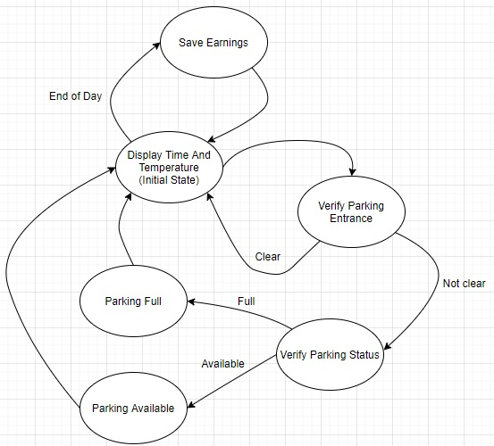

# Smart-Parking
## 1. Introduction
This is an academic project developed in the private high school of engineering and technologies (ESPRIT) situated in Tunisia.
its mainly an automated-parking controlled by two arduino uno cards .
## 2. Description
In this project we have two arduino uno cards, the first one is the master, it controlls the parking's entrance and communicates with other components, it gets the temperature and time from the DS1621 and DS1307 respectively and then display them on the LCD.
the second is the slave, it controlls the parking's exit and informs its master about the number of cars that got out from the parking.

## 3. Project architecture

## 4. State machine

